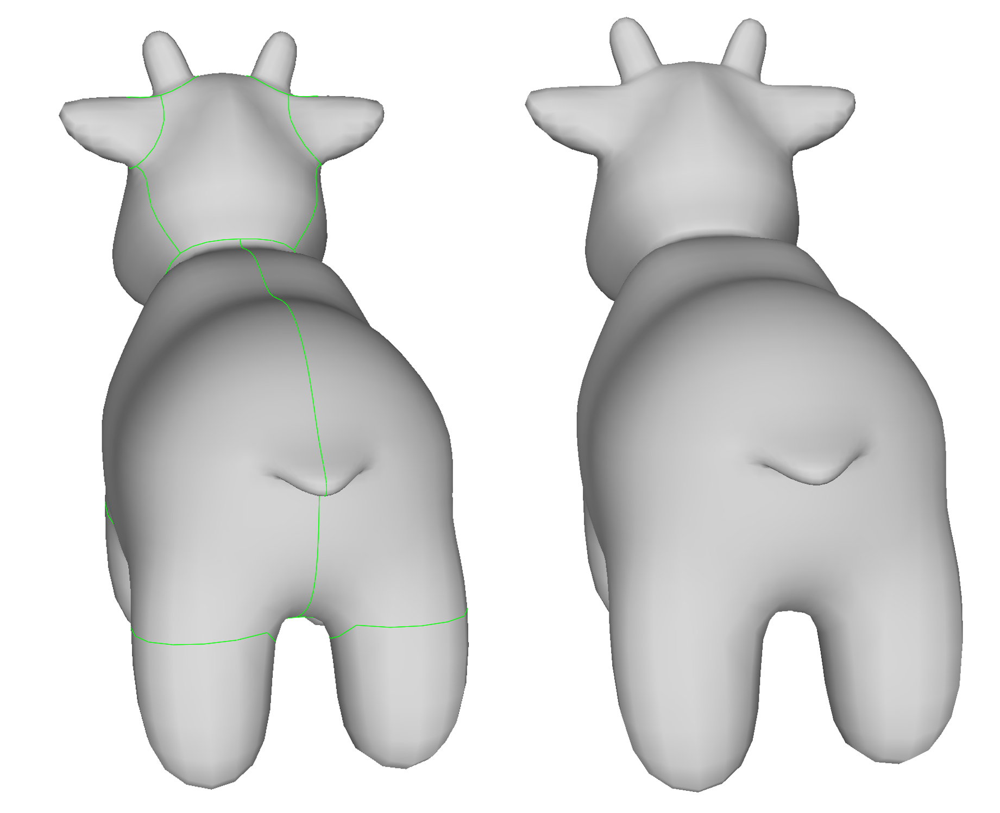
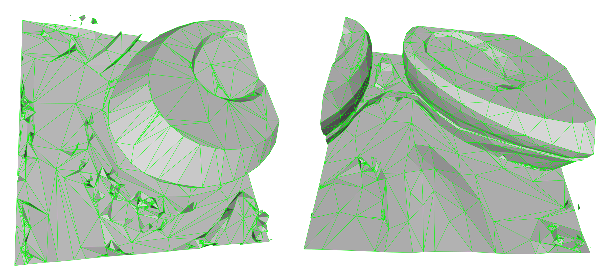
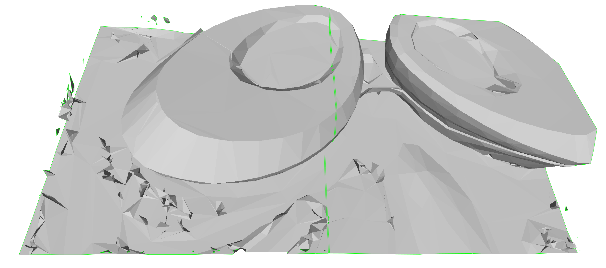

# mergeMesh

mergeDuplicateVertices: If there are internal boundaries in the model due to duplicate vertices, you can use this code to fix them.

mergeMeshes：Multiple meshes can be merged and boundaries caused by internal duplicate points can be removed.
<!-- PROJECT SHIELDS -->

<!-- PROJECT LOGO -->
<br />

<p align="center">
  <a href="https://github.com/EIPsyCongGroo/mergeDuplicateVertices/">
    
  </a>

  <h3 align="center">消除模型内部边界</h3>

<p align="center">
  <a href="https://github.com/EIPsyCongGroo/mergeDuplicateVertices/">
    
  </a>
<p align="center">
  <a href="https://github.com/EIPsyCongGroo/mergeDuplicateVertices/">
    
  </a>
  <h3 align="center">合并多个模型，并去除内部边界</h3>
  <p align="center">
   绿色线为模型内部边界，消除重复点后，内部边界消失，变成一个完整模型。
    <br />
    <a href="https://github.com/EIPsyCongGroo/mergeDuplicateVertices"><strong>探索本项目的文档 »</strong></a>
    <br />
    <br />
    <a href="https://github.com/EIPsyCongGroo/mergeDuplicateVertices">查看Demo</a>
    ·
    <a href="https://github.com/EIPsyCongGroo/mergeDuplicateVertices/issues">报告Bug</a>
    ·
    <a href="https://github.com/EIPsyCongGroo/mergeDuplicateVertices/issues">提出新特性</a>
  </p>


 本篇README.md面向开发者
 
## 目录

- [上手指南](#上手指南)
  - [开发前的配置要求](#开发前的配置要求)
  - [安装步骤](#安装步骤)
- [文件目录说明](#文件目录说明)
- [开发的架构](#开发的架构)
- [使用到的框架](#使用到的框架)
- [贡献者](#贡献者)
  - [如何参与开源项目](#如何参与开源项目)
- [版本控制](#版本控制)
- [作者](#作者)
- [鸣谢](#鸣谢)

### 上手指南


###### 开发前的配置要求

1. CLion 2013.1.2
2. OpenMesh 9.0.0

###### **安装步骤**

1. Clone the repo
2. cmake and build the project
3. Open merge.exe in terminal with your input_file or folder_path as: merge.exe input_file or folder_path

```sh
git clone https://github.com/EIPsyCongGroo/mergeDuplicateVertices.git
mkdir build
cd build
cmake .. 
merge.exe ../models/spot.obj
merge.exe ../models/mergeMeshes
```

### 文件目录说明
eg:

```
filetree 
├─CMakeLists.txt
├─main.cpp
├─README.md
│
├─images
│      spot.png
│      spot1.png
│
└─models
        spot.obj
        spot.obj-out.obj
        test.obj
        test.obj-out.obj


```


### 开发的架构 

Windows X64


### 使用到的框架

- OpenMesh
- Vcpkg
- Cmake

### 贡献者

本人是该代码唯一贡献者，有问题欢迎交流。

#### 如何参与开源项目

贡献使开源社区成为一个学习、激励和创造的绝佳场所。你所作的任何贡献都是**非常感谢**的。


1. Fork the Project
2. Create your Feature Branch (`git checkout -b feature/AmazingFeature`)
3. Commit your Changes (`git commit -m 'Add some AmazingFeature'`)
4. Push to the Branch (`git push origin feature/AmazingFeature`)
5. Open a Pull Request


### 版本控制

该项目使用Git进行版本管理。您可以在repository参看当前可用版本。

### 作者

[Wzy@EIPsyCongGroo](https://github.com/EIPsyCongGroo)

QQ:824353810    


### 鸣谢


- [GitHub Emoji Cheat Sheet](https://www.webpagefx.com/tools/emoji-cheat-sheet)
- [Img Shields](https://shields.io)
- [Choose an Open Source License](https://choosealicense.com)
- [GitHub Pages](https://pages.github.com)
- [Animate.css](https://daneden.github.io/animate.css)


<!-- links -->
[your-project-path]:EIPsyCongGroo/mergeDuplicateVertices
[contributors-shield]: https://img.shields.io/github/contributors/EIPsyCongGroo/mergeDuplicateVertices.svg?style=flat-square
[contributors-url]: https://github.com/EIPsyCongGroo/mergeDuplicateVertices/graphs/contributors
[forks-shield]: https://img.shields.io/github/forks/EIPsyCongGroo/mergeDuplicateVertices.svg?style=flat-square
[forks-url]: https://github.com/EIPsyCongGroo/mergeDuplicateVertices/network/members
[stars-shield]: https://img.shields.io/github/stars/EIPsyCongGroo/mergeDuplicateVertices.svg?style=flat-square
[stars-url]: https://github.com/EIPsyCongGroo/mergeDuplicateVertices/stargazers
[issues-shield]: https://img.shields.io/github/issues/EIPsyCongGroo/mergeDuplicateVertices.svg?style=flat-square
[issues-url]: https://img.shields.io/github/issues/EIPsyCongGroo/mergeDuplicateVertices.svg
[license-shield]: https://img.shields.io/github/license/EIPsyCongGroo/mergeDuplicateVertices.svg?style=flat-square
[license-url]: https://github.com/EIPsyCongGroo/mergeDuplicateVertices/blob/master/LICENSE.txt
[linkedin-shield]: https://img.shields.io/badge/-LinkedIn-black.svg?style=flat-square&logo=linkedin&colorB=555
[linkedin-url]: https://linkedin.com/in/shaojintian


